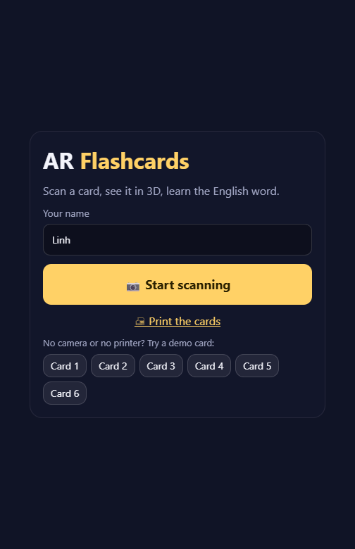
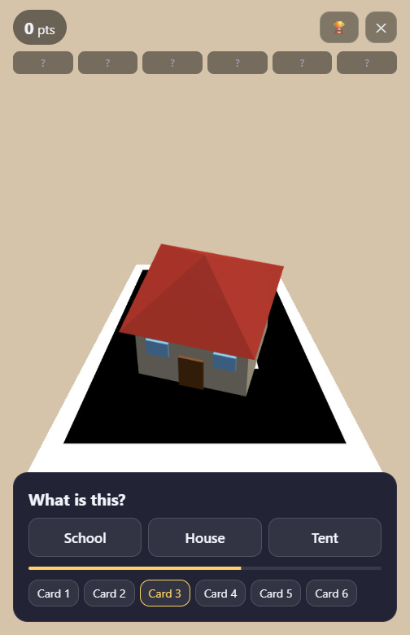
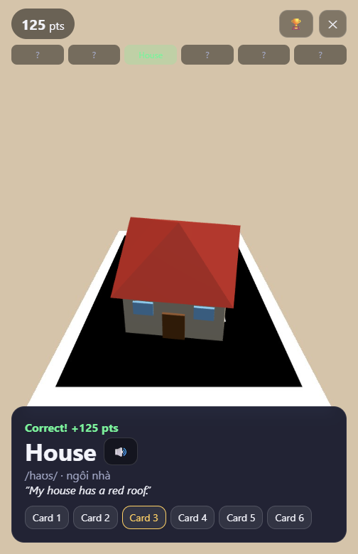
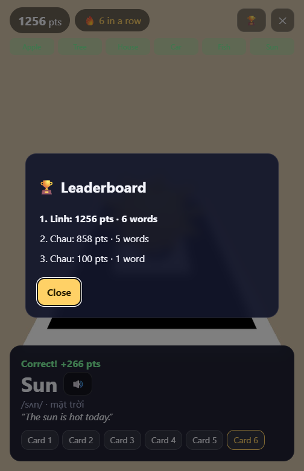
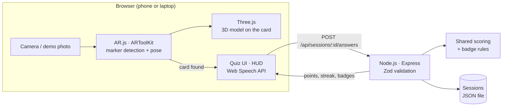

# AR Flashcards

**Point your phone at a printed card and a 3D object appears on it. Pick the right English word, hear it pronounced, collect all six.**

A WebAR vocabulary game for young English learners. It runs in the mobile browser, with no app to install.

<p align="center">
  
  
  
  
</p>

## How it plays

1. **Scan**: point the camera at one of the six printed cards.
2. **See**: a low-poly 3D object (apple, tree, house, car, fish or sun) stands on the card, tracked as you move.
3. **Answer**: *"What is this?"* with three choices. Faster answers and streaks score more.
4. **Learn**: the English word, phonetics, Vietnamese meaning and an example sentence are shown and read aloud.
5. **Collect**: finish the deck for badges and a place on the leaderboard.

<p align="center"></p>

## Features

- **Multi-marker WebAR**: AR.js / ARToolKit tracks all six cards at once and estimates each card's 3D pose from the camera feed every frame.
- **3D with Three.js**: six procedural low-poly models built from primitives, each with an idle animation, so there are no model files to download.
- **Custom markers**: a Python tool generates the ARToolKit `.patt` patterns, the printable cards and demo photos (see [Markers](#markers)).
- **Gamification**: speed bonus, capped streak multiplier, five badges and a leaderboard.
- **Pronunciation** via the Web Speech API.
- **Server-side scoring**: the API computes points and badges, so the leaderboard can't be filled with a made-up score.
- **Camera-free demo**: runs the real marker detection on photos of the cards, for trying it on a laptop.
- **Fast start**: the ARToolKit WASM engine (~740 KB gzip) loads only when scanning begins; the start screen is ~15 KB of JS.

## Architecture



| Layer | Tech |
|---|---|
| Web | TypeScript, Vite, Three.js, AR.js 3.4 (ARToolKit), Web Speech API |
| API | Node.js, Express 5, TypeScript, Zod |
| Shared | Card and API types, Zod schemas, scoring and badge rules |
| Tooling | Python + Pillow (markers), Vitest, Supertest |

```
packages/shared   types, schemas, scoring + badges (unit tested)
apps/server       REST API: deck, sessions, answers, leaderboard
apps/web          AR scanner, 3D models, quiz UI, printable cards page
tools/            make_markers.py: .patt patterns, printable cards, demo photos
```

## Getting started

Requires Node.js 20+.

```bash
npm install
npm run dev:server   # API on http://localhost:3001
npm run dev:web      # app on https://localhost:5173
```

The dev server uses a self-signed HTTPS certificate (browsers only allow camera access on secure origins), so accept the browser warning once.

**On a laptop (no camera needed):** open `https://localhost:5173`, enter a name, and pick *Card 1–6* under "Try a demo card".

**On a phone:** connect to the same Wi-Fi, open the *Network* URL that Vite prints, and allow camera access. Show the cards from `/cards.html` on another screen, or print them.

Scanning tips: keep the whole black border in view, hold the card flat, and fill roughly a quarter to half of the frame.

## Scoring

| Rule | Value |
|---|---|
| Correct answer | 100 pts |
| Speed bonus | up to +50, shrinking to 0 over 10 s |
| Streak multiplier | ×1.25 per correct answer in a row, capped at ×2 |
| Wrong answer | 0 pts, streak resets; the word is still revealed |

Badges: **First Word**, **Hot Streak** (3 in a row), **Quick Thinker** (under 3 s), **Collector** (all cards), **Perfect Deck** (all right first try).

## API

| Method | Path | Description |
|---|---|---|
| GET | `/api/deck` | The six cards |
| POST | `/api/sessions` | `{ playerName }` → new session |
| POST | `/api/sessions/:id/answers` | `{ cardId, choice, elapsedMs }` → points, streak, new badges |
| GET | `/api/leaderboard` | Top 10 |

## Markers

`tools/make_markers.py` draws each card (a letter plus a corner dot inside a thick black border) and encodes it into ARToolKit's `.patt` format: 16×16 samples, 4 rotations, BGR planes, the same way AR.js's marker generator does. The corner dot means no card looks the same when rotated, so the tracker can tell which way up it is.

```bash
npm run markers                                        # regenerate cards, patterns, demo photos
python tools/make_markers.py --check hiro.png patt.hiro  # validate the encoder against AR.js's Hiro marker
```

## Scripts

```bash
npm test          # 16 tests: scoring, badges, API rules
npm run typecheck
npm run build
```

## Notes

- AR.js depends on an older three.js; `overrides` in `package.json` plus `resolve.dedupe` in Vite keep a single copy, because two copies break rendering.
- `rollup` is overridden to `@rollup/wasm-node` because some antivirus setups quarantine its native Windows binary.
- Sessions persist to `apps/server/.data/sessions.json`. The `SessionStore` interface keeps a move to a real database in one file.
